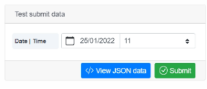
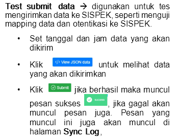
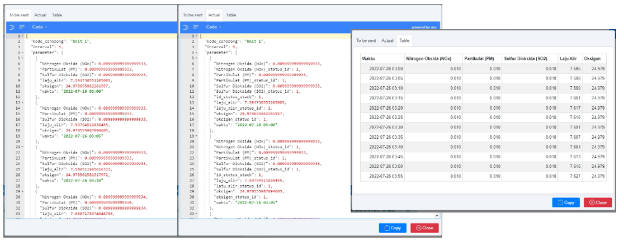

# 4. Cek Data Yang Dikirimkan Ke SISPEK?

Pergi ke halaman setting SISPEK

Cara 1 :

\>klik setting
\> pilih menu Chimney
\> pilih chimney
\> pilih tab sispek

Cara 2 :

\> klik setting

\> pilih menu SISPEK

\> pilih chimney

Pada bagian kanan terdapat tampilan Test Submit Data

View JSON data menampilkan 3 mode tampilan, To be sent (data yang akan dikirimkan ke SISPEK), Actual (data aktual yang tersimpan dari data real-time) dan Table (tampilan data yang dikirimkan ke SISPEK dalam format tabel)

