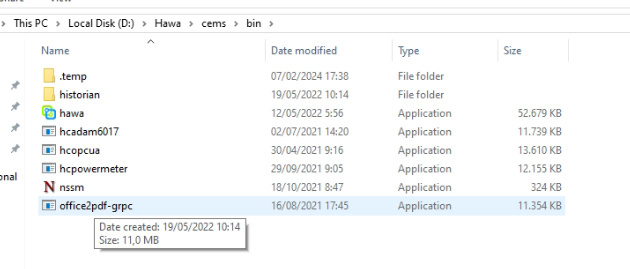

# 2. Generate Report Error?
Jika saat klik tombol Generate muncul error berikut ini, 

Error ini di sebabkan karena program  atau service yang berfungsi untuk membantu generate report ke pdf terhenti atau ter close, jadi aplikasi tidak bisa melakukan generate report tapi masih tetap bisa melakukan download excel, 
untuk problem sloving error ini adalah sebagai berikut:

1. pastikan license microsoft office sudah aktif
2. Cari dan Run file “office2pdf-grpc.exe”, secara default ada di dalam folder “d:\Hawa\cems\bin” atau ada shortcut di Start Menu Windows.

3. Kalau sudah di run coba generate report ulang,
Jika ada error selain ini silahkan hubungi tim Support Hawa