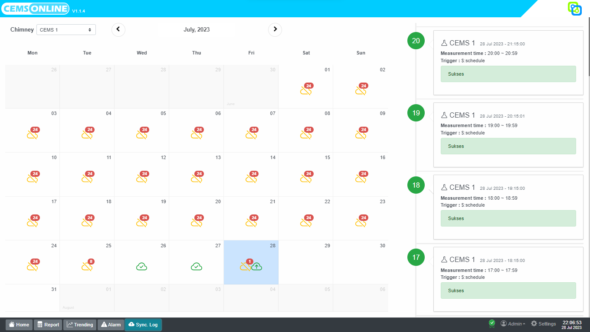
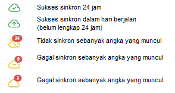
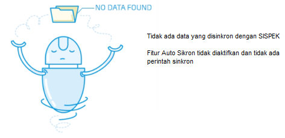
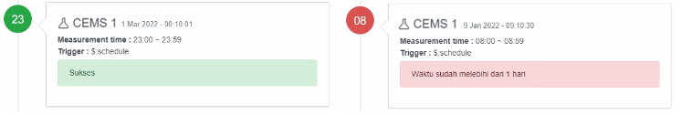
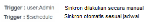
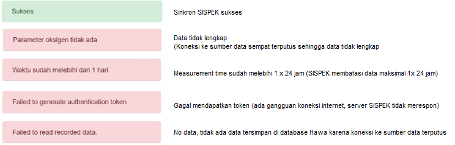

# 3. Kendala Pengiriman Data (SyncLog)?
Halaman Sync Log menampilkan status sinkronisasi CEMS Online dengan SISPEK. 
Pada halaman ini status pengiriman data ke SISPEK dapat ditelusuri untuk melihat status atau kendala sinkron sesuai waktu dan penyebabnya.

1. Pilih cerobong pada pilihan Chimney 
2. Pilih bulan pada pilihan Kalender
3. Pilih tanggal pada Kalender

Status sinkron ditampilkan di sisi kanan dalam angka 00 - 23, warna hijau 
ika status sinkron sukses, warna merah jika status sinkron gagal, dilengkapi detail cerobong, tanggal dan waktu sinkron, waktu pengukuran, trigger sinkron dan respon SISPEK. Jika tidak ada sinkron, akan tampil status No Data Found.

Lingkaran angka 00 – 23 🡪 Status sinkron untuk waktu tersebut, hijau = sukses, merah = gagal
Tanggal dan jam 🡪 timestamp waktu sinkron
Measurement time 🡪 Waktu pengukuran

Untuk menjaga sinkron data secara continue pastikan :
1. Koneksi internet lancar
2. Server sispek / klhk ( https://ditppu.menlhk.go.id ) tidak di block firewall
3. Pastikan data CEMS juga ter record di database dengan cara cek pada halaman trending atau report

Kalau ada error lain terkait synclog silahkan hubungi tim Support Hawa

