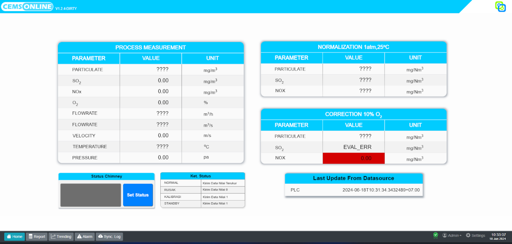
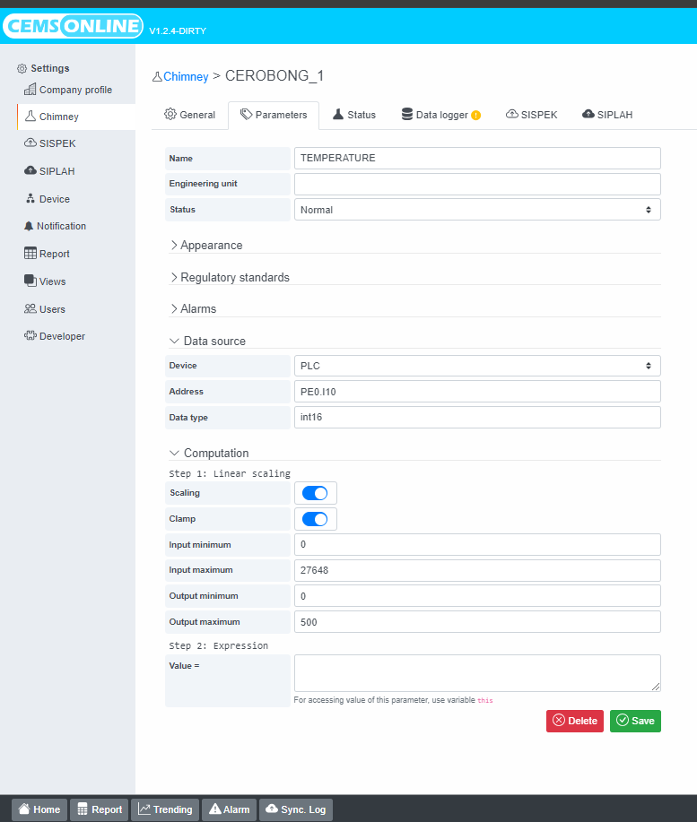
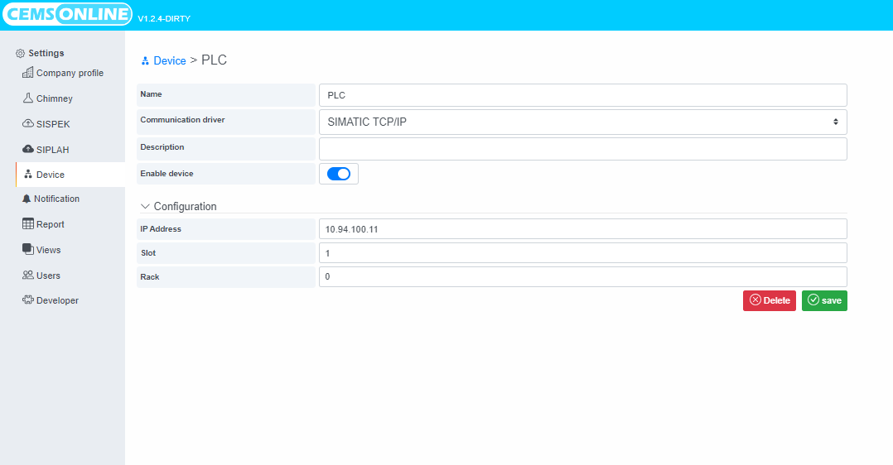
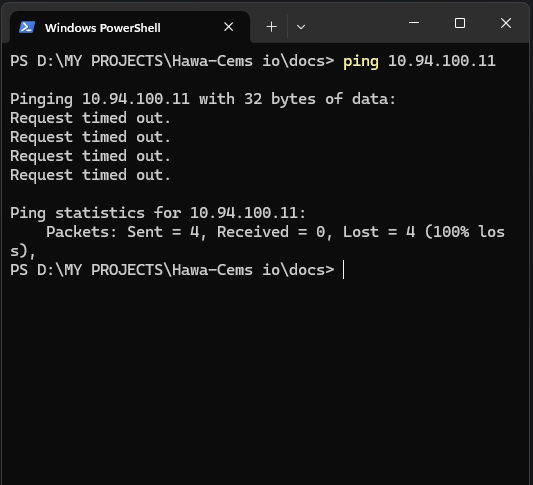
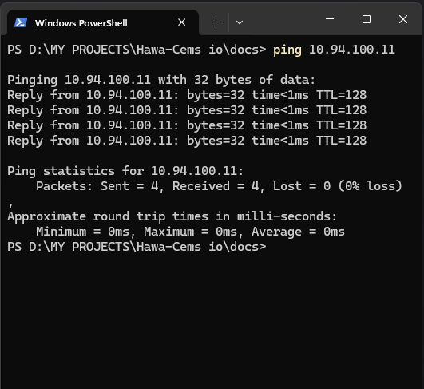

# 1. Pengukuran parameter CEMS bermasalah?

Indikasi nilai pengukuran pengukuran parameter bermasalah yaitu pada halaman Dashboard menampilkan **???, undefined, EVAL_ERR, atau nilai realtime tidak update**

Apabila ada parameter yang menampilkan nilai **undefined, ????, atau nilainya tidak update** berarti akses atau koneksi ke sumber data parameter tersebut terganggu,
Kemudian apabila ada parameter yang menggunakan formula dari parameter yang menampilkan **undefined, ????** atau parameter yang tidak muncul nilainya maka formula perhitungannya dianggap tidak valid dan akan menampilkan nilai **EVAL_ERR**

**Trobleshooting :**

1. Cek dulu ke menu konfigurasi parameter, caranya masuk ke menu setting > chimney > pilih chimney yang parameternya bermasalah > pilih parameternya untuk ngecek konfigurasi parameternya misal temperature

 Pada bagian datasource terdapat kolom Device , Address & Data type pastikan konfigurasi Datasource ini sesuai dengan konfigurasi / mapping yang disediakan sumber data,  kalau ke 3 ini sudah  sesuai dengan address mapping parameter berarti pada bagian setting parameter ini tidak ada masalah, lanjut ke Langkah ke 2

2. Cek konfigurasi pada menu device karena di menu ini berfungsi untuk mengkonfigurasi koneksi ke sumber data.

Cara masuk ke Menu Device: 
masuk ke menu setting > pilih Device > pilih device yang sesuai dengan konfigurasi data source parameter yang nilainya undefined , ???? atau nilainya tidak update

Nah maka akan tampil halaman seperti di atas, yaitu tampilan konfigurasi untuk konek dengan sumber data. Hal pertama yang perlu di lakukan untuk mengecek koneksi dengan sumber data adalah dengan melakukan ping ke ip address sumber data ,
silahkan copy ip address pada kolom ip address kemudian paste kan pada terminal cmd untuk ping ip address sumber data nya , kalua respon nya request time out, maka bisa di pastikan ada masalah koneksi antara sumber data dan Server DIS jadi perlu minta bantuan tim IT dan juga tim Support hawa untuk memperbaiki masalah koneksi ini. Kalau respon nya reply berarti ada sesuatu hal yang lain yang menyebabkan Hawa / sumber data tidak menampilkan nilai

response ping RTO

response ping Reply

Berikut beberapa problem & problem sloving yang bisa di lakukan user, kalau problem sloving sudah di lakukan tapi belum bisa normal silahkan hubungi tim IT, vendor CEMS & tim Support Hawa 

Setelah melakukan pengecekan seperti di atas berikut beberapa kemungkinan problem nya :
1. kabel LAN antara Server DIS & Sumber Data tidak terhubung dengan baik
2. ada perubahan ip address pada Server DIS atau Sumber Data
3. konfigurasi mapping parameter antara server DIS & sumber data tidak cocok
4. port untuk jalur sumber data ter block firewall
5. sumber data bermasalah atau rusak
6. driver aplikasi untuk collect data dari sumber data mengalami crash atau ter stop

Berikut problem sloving nya :
1. Pastikan kabel LAN antara server DIS dan sumber data terhubung dengan baik
2. pastikan ip address antara server DIS & sumber data sudah dalam 1 segmen jaringan yang sama dan bisa saling komunikasi atau tes ping
3. mengecek data list mapping parameter / addressing antara sumber data & mapping di server DIS                                                                                                      sudah cocok
4. pastikan port yang di gunakan untuk akses sumber data tidak terhalang firewall
5. cek kondisi device sumber data
6. perlu restart service aplikasi (harus di lakukan oleh tim Support Hawa)
