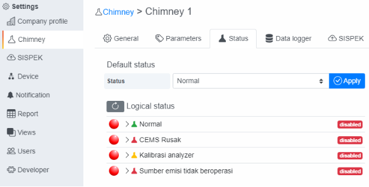
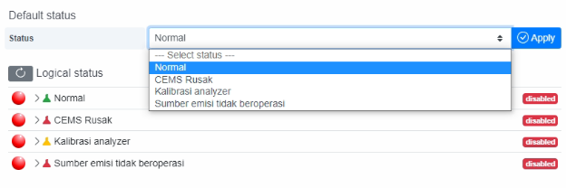
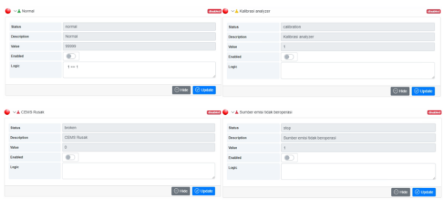
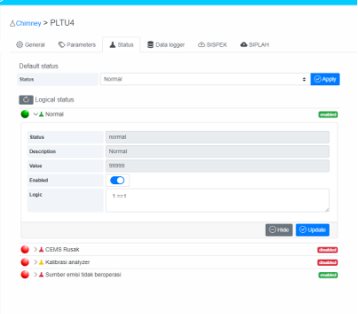
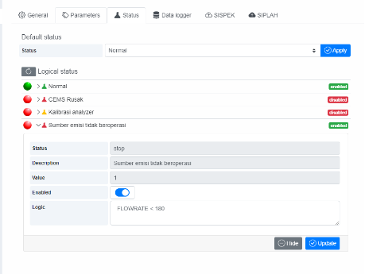
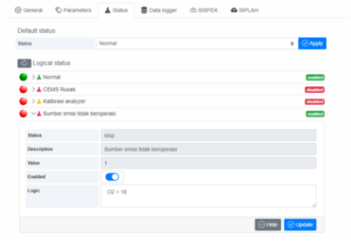
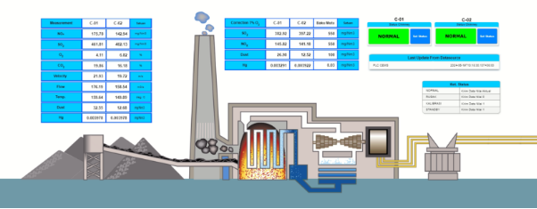
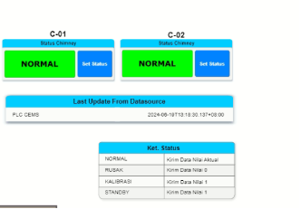

# 5. Set Status Chimney?
Tab **Status** merupakan halaman untuk pengaturan informasi status cerobong dibuat sesuai dengan Permen LHK No. 13 tahun 2021, dengan 4 kondisi:

- **Normal**  mengirimkan sesuai nilai pengukuran ke SISPEK
- **CEMS Rusak**  mengirimkan nilai “0” ke SISPEK
- **Kalibrasi Analyzer**  mengirimkan nilai “1” ke SISPEK
- **Sumber emisi tidak beroperasi**  mengirimkan nilai “1” ke SISPEK

<!--  -->

<!--  -->

Pengaturan Status cerobong dapat dilakukan secara manual (memilih Default Status) dan secara otomatis dengan menerapkan logic untuk masing-masing Logical Status dan mengaktifkan logical status tersebut.

<!--  -->

Jika menerapkan logic pada Logical status, urutan prioritas adalah sebagai berikut:

**Sumber emisi tidak beroperasi    Prioritas Tertinggi** 

**Kalibrasi Analyzer**

**CEMS Rusak**

**Normal**

**Default Status   Prioritas Terendah**

Dengan urutan prioritas ini, jika logic pada “Sumber emisi tidak beroperasi” terpenuhi, maka otomatis status lain tidak akan pengaruh lagi dan CEMS Online Hawa akan set nilai “1” untuk data 5 menit terakhir sejak logic tersebut terpenuhi.

Demikian selanjutnya, untuk Logical status yang lainnya juga, jika Logical status diaktifkan (enable). Dalam kondisi Logical status ada yang aktif dan logicnya terpenuhi, maka apapun pilihan di Default status tidak akan pengaruh (diabaikan).

Jika menggunakan Default status, semua Logical status harus  dinonaktifkan (disable).

Untuk Logic berupa perbandingan nilai parameter (< / > / >= / <= / ==), status parameter dan dapat terdiri dari beberapa kondisi dengan logic AND (&&) atau OR (||)

Berikut Contoh Logical Status :

Kalau ingin menggunakan Logical status WAJIB untuk Logical Status Normal di isi 1==1 untuk menyatakan always true / atau selalu aktif, jadi di saat kondisi logical status CEMS Rusak, Kalibrasi Analyzer & Sumber Emisi Tidak beroperasi  maka Logical status akan mengembalikan status ke Normal & mengirimkan nilai aktual secara otomatis

<!--  -->

Contoh Logical Status CEMS tidak beroperasi

<!--  -->

Logic FLOWRATE < 180 artinya di saat nilai FLOWRATE kurang dari 180 maka status Sumber emisi tidak beroperasi akan aktif & pengiriman data ke SISPEK akan nilai 1 , , sedangkan apabila O2 kurang dari 18 maka Status akan kembali ke Normal karena telah di isi logic 1==1  

<!--  -->

Logic O2 > 18 artinya di saat nilai O2 lebih dari 18 maka status Sumber emisi tidak beroperasi akan aktif & pengiriman data ke SISPEK akan nilai 1, sedangkan apabila O2 kurang dari 18 maka Status akan kembali ke Normal karena telah di isi logic 1==1  

<!--  -->

Pada halaman dashboard juga bisa di tampilkan status cerobong aktual seperti gambar ini 

<!-- ! -->

Untuk menampilkan status cerobong aktual pada dashboard silahkan hubungi tim Support hawa

<!-- [ref1]: 
[ref2]:  -->
