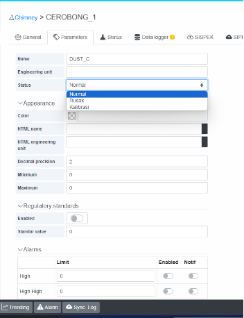
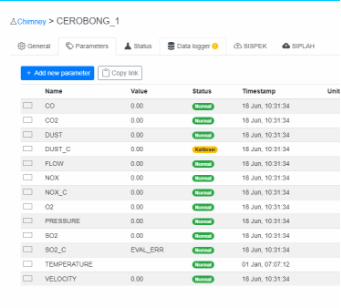

# 6. Set Status Parameter?

Cara set status Parameter :
\>klik setting 
\> chimney 
\> pilih chimney 
\> pilih parameter yang ingin di set status nya 
\> klik kolom status akan muncul pilihan status
\> pilih status yang di inginkan
\> klik save
<!--  -->

Maka pada kolom status akan berubah menjadi kalibrasi & apabila yang di set status ini parameter yang di kirimkan ke sispek, maka akan di format menjadi nilai 1 sebelum di kirimkan ke sispek

